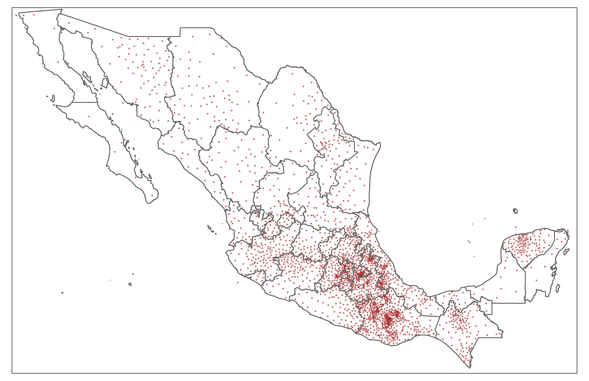
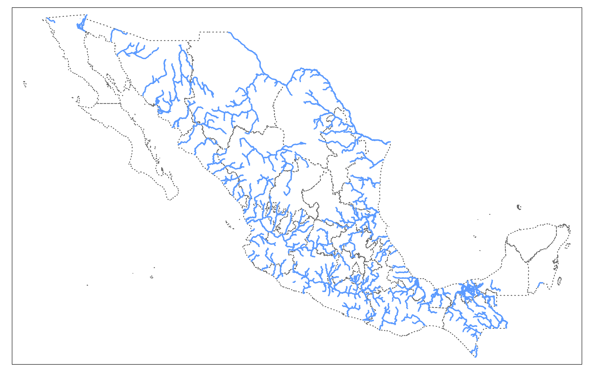
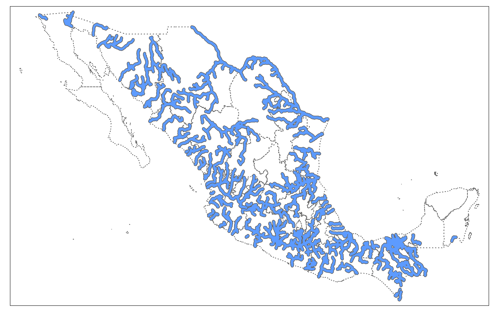
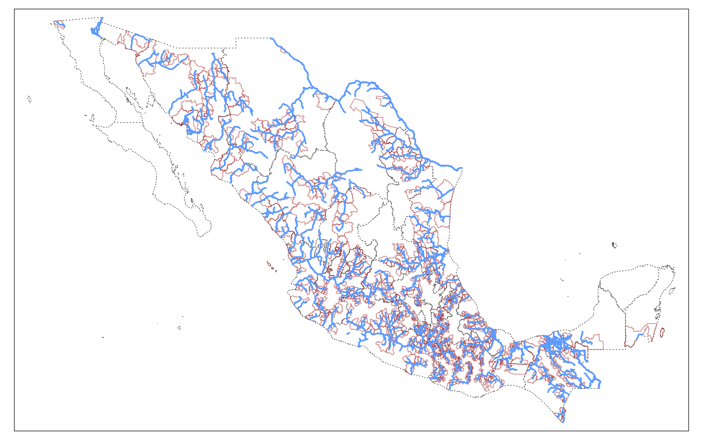
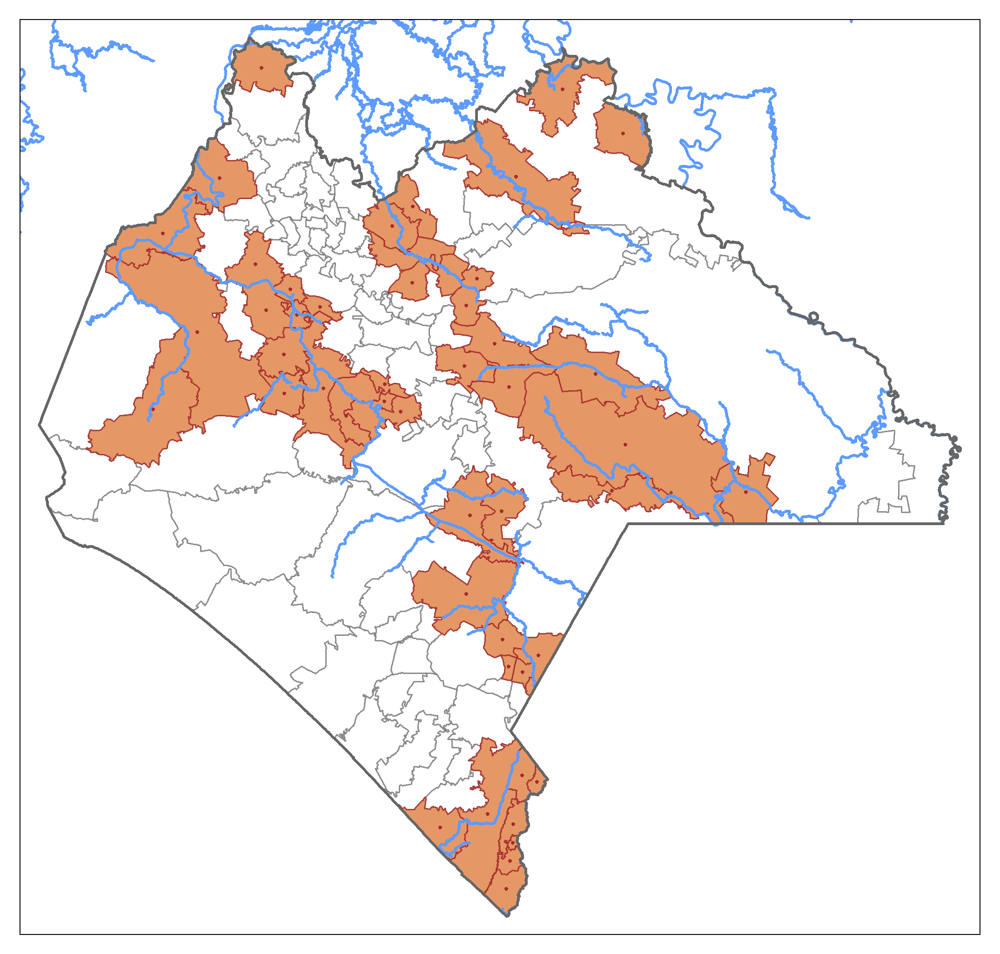

# Find municipalities within some distance from a river

Constantino Carreto Dec 26, 2022

In this project, I use spatial-analysis techniques to find the municipalities whose centroid is 10 km or less from a river, for Mexico. This could be of interest if for instance, we are interested in finding the municipalities that could be affected the most by floods or exposed to diseases transmited by mosquitoes. I try to exemplify some spatial techniques and the previous data prepartion to be able to implement this spatial analysis. This example can be easily extended to other spatial techniques. I use only a pair of functions of the [sf](https://r-spatial.github.io/sf/) package, but this package has many available functions. 

First, I compute municipalities' centroids:

     
 On the other hand, in the case of the rivers, this is how a simple map looks like:
 

Then, I compute a buffer of 10 km for the rivers in Mexico, that is, I make the rivers "thicker" by 10 km to left and 10 to the right:

Finally, I localize the municipalities whose centroid is within 10 km or less from a river. I do this by an spatial interesection between the centroids and the rivers' buffers:

This is a close-up for the state of Chiapas:

To find the municipalities that are crossed by a river I could have simply intesected the municipalities' polygons and the rivers' buffers, but I added the centroid component to exemplify its computation. Besides, by using the centroids, we could guarantee that the rivers' buffers crossed a great proportion of the munciipality, just in case we are interesed in finding municipalities with greater exposition to the rivers.
